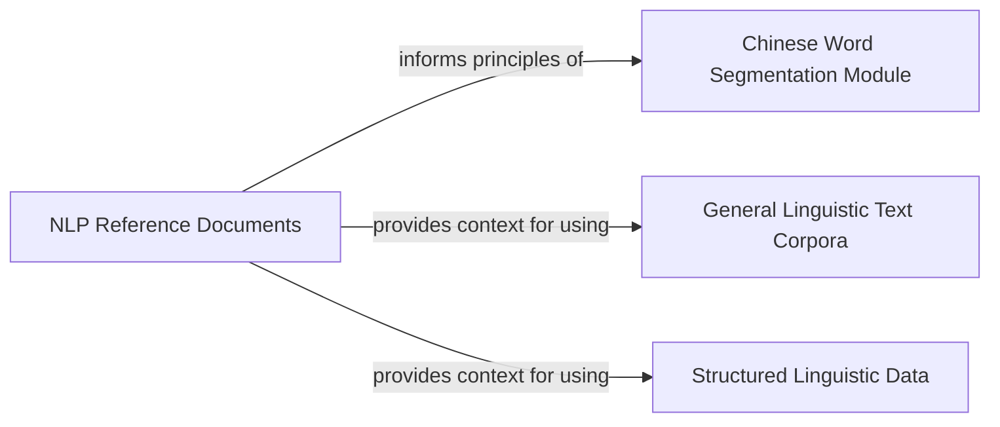

## Component Details

An NLP project focused on Chinese language processing, encompassing dictionary management, diverse linguistic corpora, structured datasets, and foundational academic references.

### Chinese Word Segmentation Module

This module is dedicated to the management, processing, and preparation of various dictionary files specifically used for Chinese word segmentation. It includes a collection of raw and processed dictionary files, along with a Python utility script (`thirtyw.py`) designed to clean, format, or refine these dictionaries. This module is crucial as Chinese word segmentation is a foundational step for most subsequent Chinese Natural Language Processing (NLP) tasks, providing the necessary lexical resources.

**Related Classes/Methods**:

- <a href="https://github.com/fighting41love/funNLP/blob/master/data/中文分词词库整理/thirtyw.py#L1-L1" target="_blank" rel="noopener noreferrer">`data/中文分词词库整理/thirtyw.py` (1:1)</a>

- `data/中文分词词库整理/30wChinsesSeqDic.txt` (1:1)

- `data/中文分词词库整理/30wChinsesSeqDic_clean.txt` (1:1)

- `data/中文分词词库整理/30wdict.txt` (1:1)

- `data/中文分词词库整理/30wdict_utf8.txt` (1:1)

- `data/中文分词词库整理/42537条伪原创词库.txt` (1:1)

- `data/中文分词词库整理/QQ拼音词库/QQ拼音词库导出.txt` (1:1)

- `data/中文分词词库整理/dict.txt` (1:1)

- `data/中文分词词库整理/fingerDic.txt` (1:1)

- `data/中文分词词库整理/httpcws_dict.txt` (1:1)

- `data/中文分词词库整理/out.txt` (1:1)

- `data/中文分词词库整理/五笔词库.TXT` (1:1)

- `data/中文分词词库整理/四十万可用搜狗txt词库.txt` (1:1)

- `data/中文分词词库整理/四十万汉语大词库.txt` (1:1)

- `data/中文分词词库整理/百度分词词库.txt` (1:1)

- `data/中文分词词库整理/搜狗词库方法.txt` (1:1)

- `data/中文分词词库整理/词库下载地址.txt` (1:1)

- `data/中文分词词库整理/词库地址.txt` (1:1)

### General Linguistic Text Corpora

This is the largest and most diverse component, comprising a vast collection of raw text-based linguistic datasets. These corpora cover a wide array of domains, including IT terms, Chinese abbreviations, stop words, names (Chinese, English, Japanese), ancient poetry, legal terms, medical vocabulary, and more. These are fundamental as they serve as the raw material for training, testing, and applying various NLP models and algorithms across a broad spectrum of linguistic tasks.

**Related Classes/Methods**:

- `data/IT词库/IT.txt` (1:1)

- `data/中文缩写库/中文缩写.txt` (1:1)

- `data/停用词/stopwords.txt` (1:1)

- `data/中英日文名字库/Chinese_Names_Corpus/Chinese_Names_Corpus.txt` (1:1)

- `data/中英日文名字库/English_Names_Corpus/English_Names_Corpus.txt` (1:1)

- `data/中英日文名字库/Japanese_Names_Corpus/Japanese_Names_Corpus.txt` (1:1)

- `data/古诗词库/古诗词.txt` (1:1)

- `data/同义词库、反义词库、否定词库/同义词.txt` (1:1)

- `data/同义词库、反义词库、否定词库/反义词.txt` (1:1)

- `data/同义词库、反义词库、否定词库/否定词.txt` (1:1)

- `data/地名词库/地名.txt` (1:1)

- `data/成语词库/成语.txt` (1:1)

- `data/汽车品牌、零件词库/汽车品牌.txt` (1:1)

- `data/汽车品牌、零件词库/汽车零件.txt` (1:1)

- `data/法律词库/法律.txt` (1:1)

- `data/职业词库/职业.txt` (1:1)

- `data/诗词短句词库/诗词短句.txt` (1:1)

- `data/财经词库/财经.txt` (1:1)

- `data/食物词库/食物.txt` (1:1)

### Structured Linguistic Data

This component contains structured linguistic datasets, primarily in JSON format. These files are crucial for specific NLP tasks that require pre-formatted or annotated data, such as rumor detection. The structured nature of this data makes it directly usable for supervised learning and other data-driven NLP approaches.

**Related Classes/Methods**:

- `data/中文谣言数据/rumors_v170613.json` (1:1)

### NLP Reference Documents

This component serves as a knowledge base, containing academic papers and notes related to Natural Language Processing in PDF format. While not directly executable code or raw data for processing, these documents are fundamental for understanding the theoretical underpinnings, research context, and advanced techniques in NLP, which are essential for anyone working with the linguistic data provided in the project.

**Related Classes/Methods**:

- `data/NLP_BOOK/eisenstein-nlp-notes.pdf` (1:1)

- `data/paper/LLM_Survey_Chinese_0418.pdf` (1:1)

- `data/中文分词词库整理/中文分词十年又回顾- 2007-2017/中文分词十年又回顾- 2007-2017 CWS-10Year-Review-2.pdf` (1:1)

### [FAQ](https://github.com/CodeBoarding/GeneratedOnBoardings/tree/main?tab=readme-ov-file#faq)